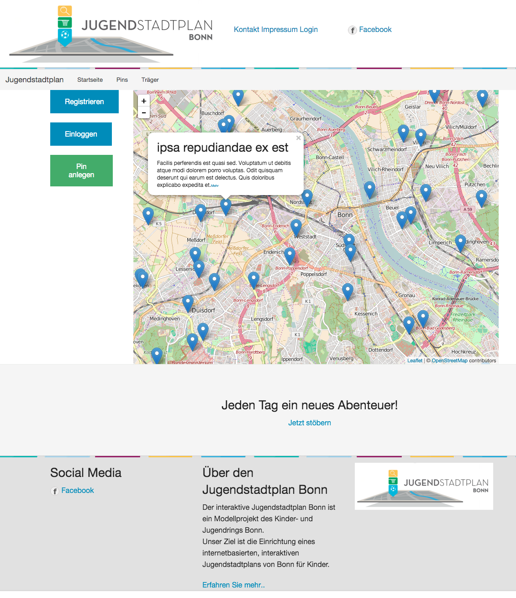

# Jugendstadtplan

Das Projekt ist eine Single-Page-App auf Basis von Angular im Frontend und Symfony2 im Backend.

## Installation

Für die Installation des Projektes sind eine Reihe von Befehlen notwendig.

1. Das Projekt nutzt eine Virtuelle Umgebung, um so isoliert wie möglich zu sein. Dazu müssen die Programme `VirtualBox` und `vagrant` installiert sein. Siehe auch [vagrantup.com](https://www.vagrantup.com/).
    Zusätzlich nutzen wir ein DNS-Plugin für vagrant, damit wir die virtuelle Maschine über einen einfachen Namen ansteuern können. Um das Plugin zu installieren, bzw. zu starten muss man folgende Schritte ausführen:
    
    - `vagrant plugin install vagrant-dns` - Das DNS-Plugin in Vagrant installieren
    - `vagrant dns --install` - Den eigentlichen DNS-Resolver installieren
    - `vagrant dns --start` - DNS-Resolver starten

2. Um die virtuelle Maschine hochzufahren reicht ein `vagrant up`. Der erste Start wird recht lange dauern, da dann erst noch das Image gezogen werden muss. 
Mit einem `vagrant ssh` kann man sich dann in die virtuelle Maschine per SSH einloggen. Die Arbeitskopie wird in das Standard-Webserver-Verzeichnis von Ubuntu `/var/www` per RSYNC kopiert. Ein `gulp watch` führt man also innerhalb der virtuellen Maschine aus.

3. Das Backend lässt sich einfach per `composer install` betriebsfertig machen. Der Befehl muss natürlich im Webserver-Verzeichnis ausgeführt werden.

4. Datenbank installieren: Beim ersten Start muss noch die Datenbank installiert werden. Dazu muss man zunächst seine Zugangsdaten für Symfony2 erreichbar ablegen. Die lokalen Parameter für Symfony2 werden üblicherweise unter `app/config/parameters.yml` abgelegt. Beispiel:

        parameters:
            database_driver: pdo_mysql
            database_host: 127.0.0.1
            database_port: null
            database_name: jugendstadtplan
            database_user: root
            database_password: root
            mailer_transport: smtp
            mailer_host: 127.0.0.1
            mailer_user: null
            mailer_password: null
            locale: de
            secret: 'lnksnkln343%nls3"§nli=(lli__hIDFJNKssk44'
 
    Die Installation kann dann mit den folgenden Befehlen geschehen:
    
        php app/console doctrine:database:create -qn
        php app/console doctrine:schema:update --force

5. Die für das Frontend benötigten Bibliotheken kann man mit `bower install` installieren.

Jetzt kann man im Browser einfach [www.jugendstadtplan.dev](http://www.jugendstadtplan.dev) aufrufen, und die Webseite erscheint.

6. Für die Authentifizierung muss ein Schlüssel generiert werden, da mit diesem das Javascript Web Token (JWT) signiert wird.
Dazu muss man einfach folgende Befehle in der Shell eingeben: 

        openssl genrsa -out app/var/jwt/private.pem -aes256 4096
        openssl rsa -pubout -in app/var/jwt/private.pem -out app/var/jwt/public.pem

Die Passphrase muss dann noch in der Konfiguration (app/config/parameters.yml) gespeichert werden.

Für mehr Informationen siehe [hier](https://github.com/lexik/LexikJWTAuthenticationBundle/blob/master/Resources/doc/index.md).

## Entwicklung

Für die Entwicklung sind folgende Werkzeuge notwendig:

    gulp
    
Ein einfacher Aufruf von `gulp` kompiliert SCSS- und JavaScript-Dateien. Die Kompilate werden im DocumentRoot (`public/www`) abgelegt. Zudem werden die Kompilate mit unter Versionskontrolle gestellt, da das den Installationsprozess auf dem Server vereinfacht.

Um dauerhaft alle SCSS und JavaScript-Dateien zu überwachen und ggf. neu zu kompilieren reicht ein Aufruf von `gulp watch`.

Die `public/www/index.php` ist unser Einstiegspunkt in die Applikation.

Das Backend wird über api.jugendstadtplan.dev angesprochen. Dieses ist ein Standard-Symfony; es lassen sich also über `app/console` diverse Befehle über die Symfony-Console ausführen.

### Testdaten

Testdaten können über folgendes Kommando generiert werden:

        php app/console hautelook_alice:doctrine:fixtures:load -n

### Troubleshooting

#### Die Seite ist nicht erreichbar

Es kann sein, dass der Webserver nicht automatisch gestartet wird. Dann reich ein einfaches `sudo apache2ctl restart` um ihn zu (neuzu-) starten. Falls das nicht hilft, muss evtl. ausserhalb der Virtuellen Maschine das DNS-Plugin neu gestartet werden `vagrant dns -r`.

#### Die Datenbank ist nicht erreichbar

Vielleicht ist sie gar nicht an. Ein `sudo /etc/init.d/mysql restart` sollte helfen.

## Betrieb

Das DocumentRoot für [www.jugendstadtplan.de](http://www.jugendstadtplan.de) muss das `public/www`-Verzeichnis sein. Für [api.jugendstadtplan.de](http://api.jugendstadtplan.de) muss das `web`-Verzeichnis konfiguriert sein.
